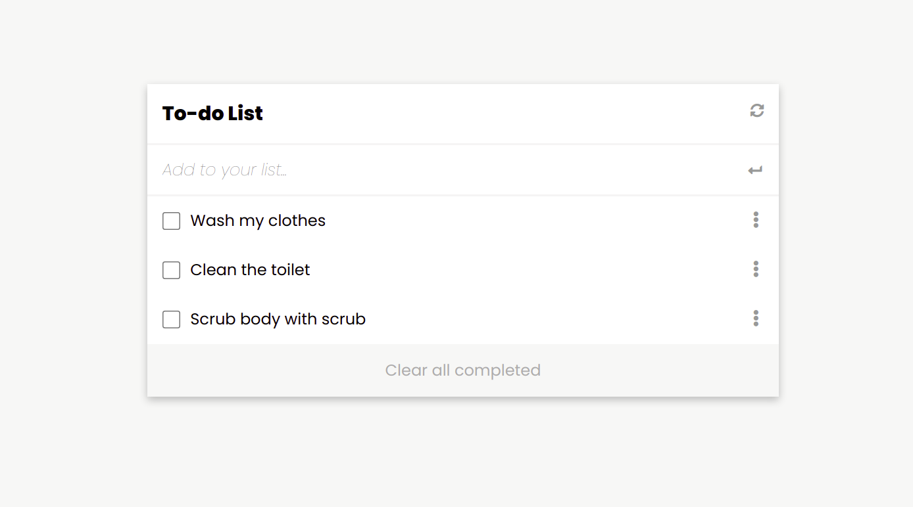

# To-do 

> To-do is a project that creates a todo list



Additional description about the project and its features.

## Built With

- Major languages (HTML, CSS, JavaScript)
- Frameworks (None)
- Technologies used - Webpack(Code Bundlng et al), Git(version control), ESLint(JavaScript linting), WebHint(linting tool), Stylelint(style linting)

## Live Demo

[Live Demo Link](https://anselemodims.github.io/To-Do/src/)


## Getting Started

To get a local copy up and running follow these simple example steps.

### Prerequisites
 - A text editor(preferably Visual Studio Code)
### Install
  -  [Git](https://git-scm.com/downloads)
  -  [Node](https://nodejs.org/en/download/)
### Usage
  - Clone the repository using  ``` git clone git@github.com:AnselemOdims/Portfolio.git ```
  -  cd into the project folder
  -  Run ``` npm install ```
  -  Run ``` npm run build ```
  -  Run ``` npm start ```

## Authors

👤 **Anselem Odimegwu**

- GitHub: [github](https://github.com/AnselemOdims)
- LinkedIn: [LinkedIn](https://www.linkedin.com/in/anselem-odimegwu-65a679104/)

## 🤝 Contributing

Contributions, issues, and feature requests are welcome!

Feel free to check the [issues page](../../issues/).

## Show your support

Give a ⭐️ if you like this project!

## Acknowledgments

- Hat tip to anyone whose code was used
- Inspiration
- etc

## 📝 License

This project is [MIT](./MIT.md) licensed.